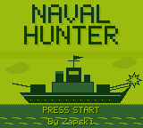

# NAVAL HUNTER

A complete turn-based naval combat game for the original **Game Boy** (DMG),
written in C with [GBDK-2020](https://github.com/gbdk-2020/gbdk-2020). You versus
the computer: hunt and sink its fleet before it sinks yours.

Written from scratch — no game engine, no sound library, no art tools beyond
Python + Pillow on the build host.



## Controls

| Screen | Buttons |
|---|---|
| Title | **START** to begin |
| Boot menu | **A** = random fleet, **B** = place your own, **SELECT** = AI level (EASY / NORMAL / HARD) |
| Placing ships | D-pad move · **B** rotate · **A** commit · **START** randomise the rest |
| In battle | D-pad aim · **A** fire · **SELECT** flip between enemy / your waters |
| Game over | **START** play again · **SELECT** swap fleet view |

## How it plays

- Classic 10x10 rules: fleet of **5, 4, 3, 2, 2, 1, 1** (18 squares), ships never
  touch — every ship needs a one-cell moat.
- Turn-based. Hit, miss, and a ship is announced and revealed when its last square
  is hit.
- Only room for one board on a 160x144 screen, so **SELECT flips** between the
  enemy waters you are shelling and your own waters.
- The computer hunts on a parity pattern, then switches to sweeping the four
  neighbours of any hit until the ship is dead.
- **START replays** from the game-over screen without a reset.
- A **boot-only title screen** with a flashing PRESS START (the wave pattern
  either side of the word stays still — only the lettering blinks).
- End-of-game **full-screen art with a 5-second hold**, then the fleet reveal.
- **Explosion sound** on a hit, a lower/longer one when a ship goes down, driven
  straight off the noise channel.

## Building

Needs GBDK-2020 (tested with **4.5.0**). Point `GBDK_HOME` at your install:

```sh
make            # -> navalhunter-zap.gb
make usage      # ROM/RAM usage breakdown
make test       # host unit tests for the placement rules (plain gcc, ~1 s)
```

The generated `gfx.h` is committed, so a plain `make` works with no other
dependencies. To regenerate it from `art/`, you also need Python + Pillow:

```sh
python3 mkgfx.py    # rewrites gfx.h from art/*.png
```

## The code

| File | What it is |
|---|---|
| `main.c` | The whole game: screens, turn loop, rendering, input, sound |
| `place.h` | Fleet-placement rules. **No Game Boy dependencies**, so it is testable on the host |
| `tests/test_place.c` | Host unit tests for `place.h` (`make test`) |
| `mkgfx.py` | Turns the PNG art into Game Boy tiles and generates `gfx.h` |
| `gfx.h` | Generated tile data — do not hand-edit |
| `art/` | Source art: title frames, win and lose screens |

`main.c` opens with a commented map of the screen layout. Read that before
changing any coordinates: the 160x144 screen is exactly 20x18 tiles and nothing
scrolls, so every element lives at a fixed tile row.

### Testing without an emulator

The placement rules live in `place.h` with no hardware dependencies, so they are
covered by an ordinary host `gcc` build:

```sh
make test   # can_place / place_ship / ship_is_placed
```

Only the *rendering* of placement needs an emulator; the rules do not.

## Art

The title, win and lose screens were drawn by hand and converted to tiles by
`mkgfx.py`, which maps exact RGB values onto the DMG's four shades.

The tile budget is tight and worth knowing about: the Game Boy background has
**256** tile slots, and a full-screen 160x144 image is 20x18 = 360 tiles, so a
screen is built from deduplicated 8x8 blocks. The title's on/off frames share a
single tileset (the blink is a map swap, so nothing reloads and nothing tears).

## License

MIT — see [LICENSE](LICENSE).
